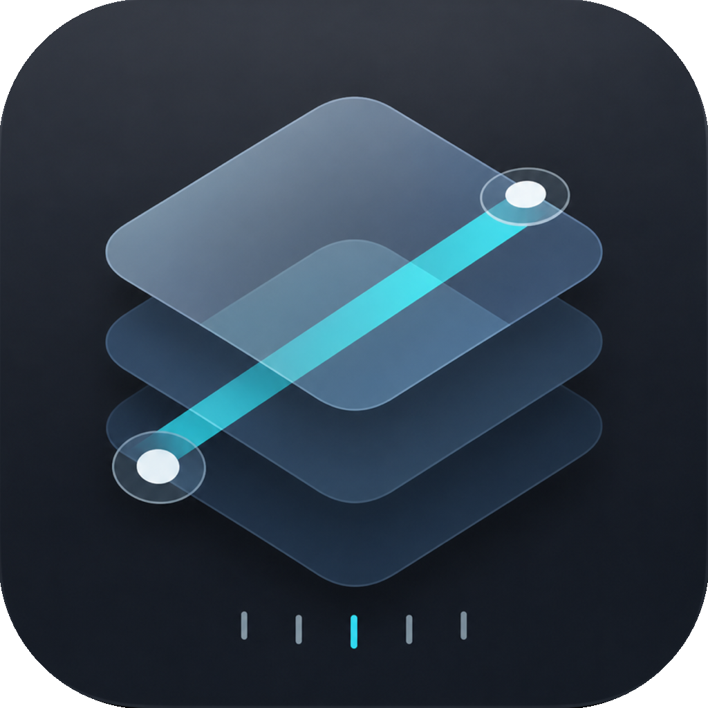
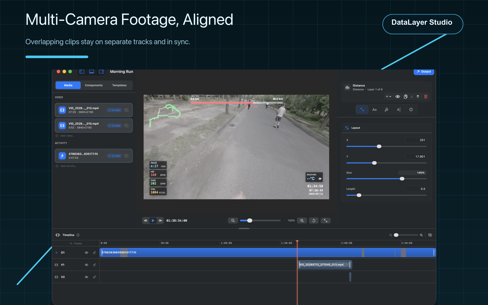
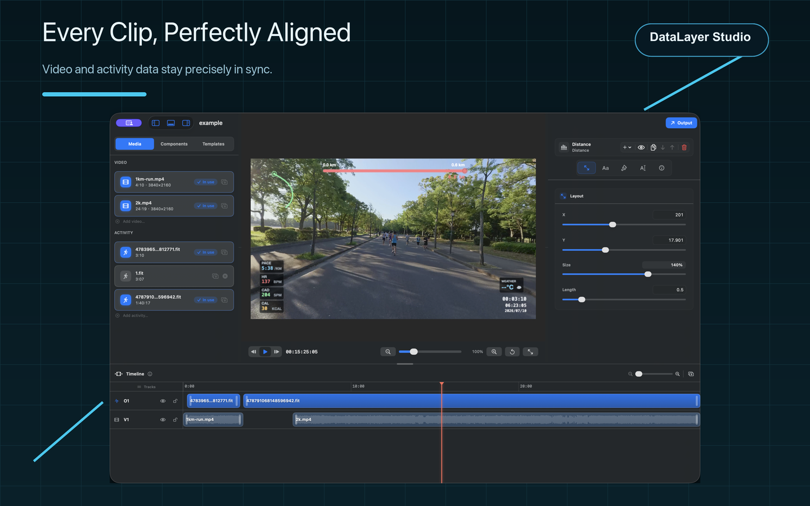
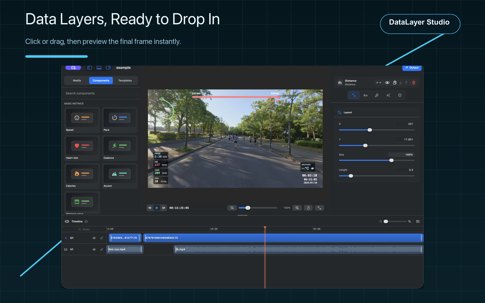
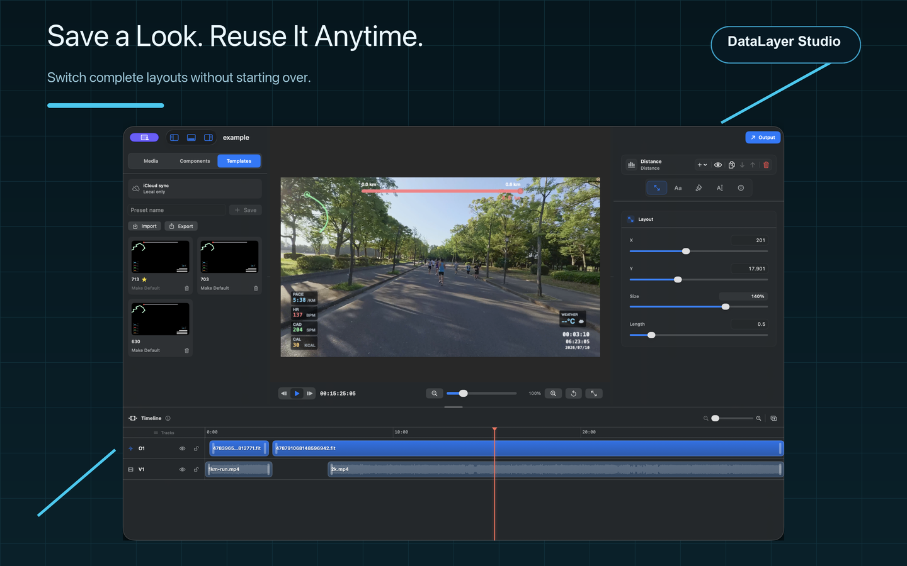

<p align="center">
  
</p>

<h1 align="center">DataLayer Studio</h1>

<p align="center">
  Turn raw running telemetry into cinematic video overlays.<br>
  Sync a <code>.fit</code> file to your footage, arrange live gauges on a canvas, and export broadcast-ready overlays — from the macOS app or the command line.
</p>

<p align="center">
  <a href="README.md"><b>English</b></a> ·
  <a href="README.zh-CN.md">中文</a>
</p>

<p align="center">
  <a href="https://github.com/leeeboo/DataLayer-Studio/actions/workflows/ci.yml"></a>
  <a href="https://github.com/leeeboo/DataLayer-Studio/releases/latest"></a>
  
  
  
  
</p>

<p align="center">
  
</p>

<p align="center">
  <b>Ready-to-post data overlays for your running videos — in minutes, not hours.</b>
</p>

<p align="center">
  <a href="https://apps.apple.com/cn/app/datalayer-studio/id6782545770">
    
  </a>
</p>

<p align="center">
  <sub>❤️ Love it? <a href="#support">Support development</a> &nbsp;·&nbsp; ⭐ Star the repo to help others find it</sub>
</p>

<p align="center">
  
</p>

<br>

## Contents

- [What it does](#what-it-does)
- [System requirements](#system-requirements)
- [Highlights](#highlights)
- [App Store screenshots](#app-store-screenshots)
- [Support](#support)
- [Quick start](#quick-start)
- [License](#license)
- [Contributing](#contributing)
- [Monitoring](#monitoring)
- [Issues](#issues)
- [Build](#build)
- [GUI](#gui)
- [CLI usage](#cli-usage)
- [Time sync](#time-sync)
- [Current FIT support](#current-fit-support)
- [Release](#release)

## What it does

DataLayer Studio turns running telemetry into clean video overlays for race
recaps, training breakdowns, and social clips. Use the macOS editor for visual
layout work, or the command-line tool for repeatable exports.

It takes:

- a source video file, used for resolution, frame rate, and duration
- a standard `.fit` activity file, used for GPS and running metrics

It can export either a transparent alpha `.mov` for Final Cut Pro, DaVinci
Resolve, Premiere, and similar editors, or a finished video with the overlay
burned in.

> DataLayer Studio is an independent project. It is not affiliated with,
> endorsed by, or sponsored by Telemetry Overlay or its developers. This
> project does not read from or modify `/Applications/Telemetry Overlay.app`,
> and it does not include proprietary code or assets from Telemetry Overlay.

## System requirements

> Requires macOS 13.0 Ventura or later on Apple Silicon Macs.

## Highlights

| | |
| --- | --- |
| 🎨 **Lightweight multitrack timeline** | Video and activity tracks support moving, trimming, splitting, snapping, locking, and undo, with gaps allowed anywhere. |
| 🎯 **Timeline-based alignment** | Drag video and activity clips, or enter an exact timeline start, so matching source events land at the same relative time. |
| 🖱 **Live layout canvas** | Drag pace, heart rate, cadence, route, distance, time, weather, and more over a live video preview. |
| ▶️ **Preview with data alone** | No video yet? Preview and play the overlay straight from a `.fit` file — just press Space. |
| 💾 **Reusable presets** | Save layout presets and reuse them across videos and styles. |
| 🎬 **Alpha or burned-in export** | Export transparent HEVC/ProRes Alpha overlays for your editor, or a fully composited video. |
| ⚙️ **Scriptable CLI** | Drive the same renderer from the command line for repeatable, automatable exports. |

## App Store screenshots

Build a reusable overlay workflow in three views: align overlapping camera clips, add and arrange telemetry components, then save the layout as a template.

| 1 · Align multiple cameras | 2 · Add components | 3 · Reuse templates |
| --- | --- | --- |
|  |  |  |

## Support

DataLayer Studio is built and maintained by one developer as an independent, source-available project. **The best way to support it is to buy it on the [Mac App Store](https://apps.apple.com/cn/app/datalayer-studio/id6782545770)** — that funds testing, sample activities, and new features.

Prefer to chip in directly? A coffee is always appreciated. For WeChat Pay or Alipay, scan the QR code.

| Buy Me a Coffee | WeChat Pay | Alipay |
| --- | --- | --- |
| <a href="https://buymeacoffee.com/leeeboo"></a><br>[Support on Buy Me a Coffee](https://buymeacoffee.com/leeeboo) |  |  |

Sponsorship is optional and does not purchase a commercial license, priority
support, or guaranteed feature work. Commercial use still requires a separate
written license.

## Quick start

Run the GUI from source:

```bash
swift run datalayer-studio
```

Or build a local app bundle:

```bash
scripts/build_app_bundle.sh
open ".build/DataLayer Studio.app"
```

Run the CLI:

```bash
swift run overlay \
  --video /path/to/run-video.mov \
  --fit /path/to/activity.fit \
  --output /path/to/overlay.mov
```

## License

DataLayer Studio is source-available for noncommercial use only. Modified
versions and derivative distributions must share their corresponding source
under the same terms.

See [LICENSE.md](LICENSE.md). This is not an OSI open-source license because
commercial use, resale, paid redistribution, and paid hosting are not permitted
without a separate written commercial license.

See [NOTICE.md](NOTICE.md) for project notices and third-party dependency notes.

## Contributing

Pull requests are welcome when they are focused, testable, and compatible with
the project license. Start here:

1. Read [CONTRIBUTING.md](CONTRIBUTING.md).
2. Open an issue first for large UI, parser, export, or licensing changes.
3. Keep PRs small enough to review in one pass.
4. Do not include private videos, FIT/GPX/TCX files, GPS traces, credentials,
   generated build output, or local machine state.
5. Run the checks that match your change.

At minimum, run the repository readiness check:

```bash
scripts/verify_source_available_readiness.sh
```

For code changes, also run:

```bash
swift test
```

The pull request template asks for the exact checks you ran. GUI-visible changes
should include a short manual verification note, such as the screen or workflow
you opened after rebuilding.

For vulnerabilities or private data exposure, follow [SECURITY.md](SECURITY.md)
instead of opening a public issue with sensitive details.

For local data handling and privacy expectations, see [PRIVACY.md](PRIVACY.md).

For general support expectations, see [SUPPORT.md](SUPPORT.md).

## Monitoring

DataLayer Studio does not include a third-party analytics SDK or custom in-app
event tracking. App usage is monitored with Apple's built-in
[App Store Connect Analytics](https://developer.apple.com/app-store-connect/analytics/)
and crash metrics, which provide aggregate data such as downloads, sessions,
active devices, retention, sales, and crash rate for users who share analytics
with developers.

## Issues

Use the issue templates for bug reports, feature requests, and documentation
fixes. Please keep public issues free of private activity data:

- redact GPS traces, names, account IDs, device IDs, and local file paths
- avoid attaching real videos or FIT files unless you are comfortable making
  them public
- use synthetic or trimmed sample data when possible
- report security problems privately through [SECURITY.md](SECURITY.md)

## Build

```bash
swift build
```

For a release binary:

```bash
swift build -c release
```

The executable will be at:

```bash
.build/release/overlay
```

## GUI

The SwiftUI editor can be launched directly from SwiftPM:

```bash
swift run datalayer-studio
```

`swift run overlay-studio` is kept as a compatibility alias for older local
scripts.

Or packaged as a local macOS app bundle:

```bash
scripts/build_app_bundle.sh
open ".build/DataLayer Studio.app"
```

The GUI supports:

- selecting a source video and `.fit` file
- playing the source video in the preview while rendering the overlay on top
- previewing and playing straight from a `.fit` file even without a video — press Space to play or pause
- a resizable multitrack timeline for video and activity clips
- configuring every output setting — resolution, frame rate, codec, bitrate, and destination — in a single **Output** panel
- aligning video and activity data by dragging clips or entering an exact relative timeline start
- gaps at the beginning or between clips, rendered as black canvas or transparency according to export mode
- moving, trimming, snapping, splitting, multiselecting, deleting, and ripple deleting timeline clips
- renaming, enabling, locking, and deleting empty tracks, plus moving clips between same-kind tracks
- saving and reopening timeline projects, with relinking for moved or inaccessible media
- dragging overlay components on the preview canvas
- changing the layer order for overlapping components
- changing component visibility, position, and size
- independently editing speed, pace, heart rate, cadence, distance value, route, distance progress, and time/date components
- changing each component's tint, opacity, font, font size, position, and size
- showing a configurable preview grid, with optional snapping while dragging
- saving, importing, exporting, and setting default layout presets
- setting output resolution and frame rate through presets or manual input
- choosing whether distance labels render in `m` or `km`
- exporting either a transparent alpha overlay or a source video with the overlay burned in
- setting output bitrate in kbps, codec, and destination

## CLI usage

```bash
swift run overlay \
  --video /path/to/run-video.mov \
  --fit /path/to/activity.fit \
  --output /path/to/overlay.mov
```

Useful options:

```bash
--width 1920        # override source width; 2...16384 and even
--height 1080       # override source height; 2...16384 and even
--fps 30            # override source frame rate
--fit-start 300     # video starts at FIT elapsed 5:00
--sync-video 12     # sync point in the video timeline
--sync-fit 0        # FIT elapsed at the same sync point
--offset 2.5        # legacy shorthand: video starts 2.5s before FIT
--bitrate 12000     # HEVC average bitrate in kbps
--bitrate-bps 12000000 # legacy explicit bitrate in bps
--export-mode overlay # default; transparent alpha overlay
--export-mode video # export source video with overlay burned in; requires --video
--codec hevc-alpha  # overlay mode default; use prores-4444 as an alpha-capable intermediate
--codec hevc        # video mode default; h264 is also available
--distance-unit km  # distance labels: km (default) or m
--layout-preset "Race Layout" # use a saved GUI layout preset by name or ID
--layout-preset presets.json # use a GUI-exported layout preset JSON file
--inspect           # parse metadata without rendering
--skip-fit-crc      # useful for malformed FIT exports
```

If `--layout-preset` is not set, the command-line renderer uses the built-in
default layout. Saved presets are looked up from the GUI's local DataLayer
Studio preferences, first by preset ID and then by case-insensitive preset name.
When the value is an existing JSON file path exported by the GUI, the CLI uses
the exported default preset when present, otherwise the first preset in the file.

## Time sync

The renderer maps each video timestamp to a FIT elapsed timestamp. You can express that mapping in three ways:

```bash
# Recording starts 12 seconds before the activity starts.
overlay --video run.mov --fit activity.fit --output overlay.mov --offset 12

# Recording starts 8 minutes 20 seconds into the activity.
overlay --video run.mov --fit activity.fit --output overlay.mov --fit-start 500

# Any precise sync point: video 3.2s matches FIT elapsed 41:15.
overlay --video run.mov --fit activity.fit --output overlay.mov --sync-video 3.2 --sync-fit 2475
```

If the video continues after FIT telemetry ends, the overlay holds the last FIT sample instead of inventing extra activity time. If the video starts before FIT telemetry begins, the overlay holds the first FIT sample until the mapped FIT elapsed time reaches zero.

## Current FIT support

The parser handles standard FIT local message definitions, little and big endian records, file/header CRC validation, normal and compressed timestamp data messages, and standard `record` message fields:

- timestamp
- position latitude/longitude
- altitude and enhanced altitude
- distance
- speed and enhanced speed
- heart rate
- cadence, converted to steps per minute for the running overlay
- power
- temperature

Parsed telemetry is normalized to activity-relative distance, enriched with distance-derived speed when FIT speed is missing or stuck at zero, and resampled to 1-second intervals so pace appears promptly at the start of a run.

Developer fields and custom streams are skipped when they are not part of the
standard telemetry channels used by the overlay. Layouts are configurable in the
GUI and can be saved, imported, exported, or reused as defaults.

## Release

GitHub Actions builds release zips only when a version tag is pushed. Regular
pull requests run the lighter CI test workflow.

Use semantic version tags:

```bash
git tag v0.1.0
git push origin v0.1.0
```

When a `v*` tag is pushed, `.github/workflows/release.yml` will:

- run `scripts/verify_source_available_readiness.sh`
- run `swift test`
- build the release products for `overlay` and `datalayer-studio`
- build `DataLayer Studio.app`
- verify the app bundle includes the required legal files
- zip the app as `DataLayer-Studio-<tag>-macOS-arm64.zip`
- generate a SHA-256 checksum
- create or update the GitHub Release for that tag and upload both files

The app bundle includes `LICENSE.md`, `NOTICE.md`, and `README.md` under
`Contents/Resources/Legal`. The zip appears under the matching tag's GitHub
Release assets.

You can verify a local app bundle before publishing:

```bash
scripts/verify_app_bundle.sh
```
