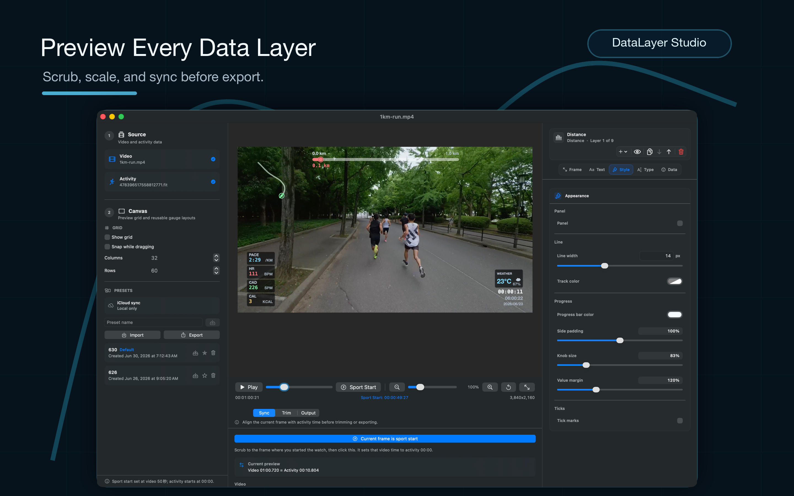

# DataLayer Studio

DataLayer Studio is a macOS app and command-line tool for generating a transparent telemetry video layer from:

- a source video file, used for resolution, frame rate, and duration
- a standard `.fit` activity file, used for GPS and running metrics

The output is a `.mov` encoded with Apple HEVC/H.265 with alpha, intended to sit on an upper track in Final Cut Pro, DaVinci Resolve, Premiere, or similar editors.

DataLayer Studio is an independent project. It is not affiliated with,
endorsed by, or sponsored by Telemetry Overlay or its developers. This project
does not read from or modify `/Applications/Telemetry Overlay.app`, and it does
not include proprietary code or assets from Telemetry Overlay.

## App preview / 应用展示



## Support / 赞助

DataLayer Studio is maintained as an independent source-available project. If it
helps your running-video workflow, sponsorship helps fund testing, sample
activities, and ongoing maintenance.

DataLayer Studio 是一个独立维护的 source-available 项目。如果它对你的跑步视频制作有帮助，
欢迎通过赞助支持后续测试、样本整理和持续维护。

Choose any of the channels below. For WeChat Pay or Alipay, scan the QR code.

可以任选下面任一渠道。微信或支付宝请扫描二维码。

| Buy Me a Coffee | WeChat Pay / 微信 | Alipay / 支付宝 |
| --- | --- | --- |
| <a href="https://buymeacoffee.com/leeeboo"></a><br>[Support on Buy Me a Coffee](https://buymeacoffee.com/leeeboo) |  |  |

Sponsorship is optional and does not purchase a commercial license, priority
support, or guaranteed feature work. Commercial use still requires a separate
written license.

赞助是自愿支持，不等同于购买商业授权、优先支持或功能承诺。商业使用仍需另行获得书面授权。

## License

DataLayer Studio is source-available for noncommercial use only. Modified
versions and derivative distributions must share their corresponding source
under the same terms.

See [LICENSE.md](LICENSE.md). This is not an OSI open-source license because
commercial use, resale, paid redistribution, and paid hosting are not permitted
without a separate written commercial license.

See [NOTICE.md](NOTICE.md) for project notices and third-party dependency notes.

## Contributing

Pull requests are welcome when they are compatible with the project license.
Please read [CONTRIBUTING.md](CONTRIBUTING.md) before opening a PR.

Maintainers and contributors can run the repository readiness check before
opening or merging PRs:

```bash
scripts/verify_source_available_readiness.sh
```

For vulnerabilities or private data exposure, follow [SECURITY.md](SECURITY.md)
instead of opening a public issue with sensitive details.

For local data handling and privacy expectations, see [PRIVACY.md](PRIVACY.md).

For general support expectations, see [SUPPORT.md](SUPPORT.md).

## Build

```bash
swift build
```

For a release binary:

```bash
swift build -c release
```

The executable will be at:

```bash
.build/release/overlay
```

## GUI

The SwiftUI editor can be launched directly from SwiftPM:

```bash
swift run datalayer-studio
```

`swift run overlay-studio` is kept as a compatibility alias for older local
scripts.

Or packaged as a local macOS app bundle:

```bash
scripts/build_app_bundle.sh
open ".build/DataLayer Studio.app"
```

The GUI supports:

- selecting a source video and `.fit` file
- playing the source video in the preview while rendering the overlay on top
- editing time sync through offset, FIT start, or sync-point mode
- setting the current preview time as `运动开始`, which maps that video frame to FIT elapsed `0`
- dragging overlay components on the preview canvas
- changing the layer order for overlapping components
- changing component visibility, position, and size
- independently editing speed, pace, heart rate, cadence, distance value, route, distance progress, and time/date components
- changing each component's tint, opacity, font, font size, position, and size
- showing a configurable preview grid, with optional snapping while dragging
- saving, importing, exporting, and setting default layout presets
- setting output resolution and frame rate through presets or manual input
- choosing whether distance labels render in `m` or `km`
- setting output bitrate in kbps, codec, and destination

## Usage

```bash
swift run overlay \
  --video /path/to/run-video.mov \
  --fit /path/to/activity.fit \
  --output /path/to/overlay.mov
```

Useful options:

```bash
--width 1920        # override source width; 2...16384 and even
--height 1080       # override source height; 2...16384 and even
--fps 30            # override source frame rate
--fit-start 300     # video starts at FIT elapsed 5:00
--sync-video 12     # sync point in the video timeline
--sync-fit 0        # FIT elapsed at the same sync point
--offset 2.5        # legacy shorthand: video starts 2.5s before FIT
--bitrate 12000     # HEVC average bitrate in kbps
--bitrate-bps 12000000 # legacy explicit bitrate in bps
--codec hevc-alpha  # default; use prores-4444 as an alpha-capable intermediate
--distance-unit km  # distance labels: km (default) or m
--layout-preset "Race Layout" # use a saved GUI layout preset by name or ID
--layout-preset presets.json # use a GUI-exported layout preset JSON file
--inspect           # parse metadata without rendering
--skip-fit-crc      # useful for malformed FIT exports
```

If `--layout-preset` is not set, the command-line renderer uses the built-in
default layout. Saved presets are looked up from the GUI's local DataLayer
Studio preferences, first by preset ID and then by case-insensitive preset name.
When the value is an existing JSON file path exported by the GUI, the CLI uses
the exported default preset when present, otherwise the first preset in the file.

## Time sync

The renderer maps each video timestamp to a FIT elapsed timestamp. You can express that mapping in three ways:

```bash
# Recording starts 12 seconds before the activity starts.
overlay --video run.mov --fit activity.fit --output overlay.mov --offset 12

# Recording starts 8 minutes 20 seconds into the activity.
overlay --video run.mov --fit activity.fit --output overlay.mov --fit-start 500

# Any precise sync point: video 3.2s matches FIT elapsed 41:15.
overlay --video run.mov --fit activity.fit --output overlay.mov --sync-video 3.2 --sync-fit 2475
```

If the video continues after FIT telemetry ends, the overlay holds the last FIT sample instead of inventing extra activity time. If the video starts before FIT telemetry begins, the overlay holds the first FIT sample until the mapped FIT elapsed time reaches zero.

## Current FIT support

The parser handles standard FIT local message definitions, little and big endian records, file/header CRC validation, normal and compressed timestamp data messages, and standard `record` message fields:

- timestamp
- position latitude/longitude
- altitude and enhanced altitude
- distance
- speed and enhanced speed
- heart rate
- cadence, converted to steps per minute for the running overlay
- power
- temperature

Parsed telemetry is normalized to activity-relative distance, enriched with distance-derived speed when FIT speed is missing or stuck at zero, and resampled to 1-second intervals so pace appears promptly at the start of a run.

Developer fields and custom streams are skipped when they are not part of the
standard telemetry channels used by the overlay. Layouts are configurable in the
GUI and can be saved, imported, exported, or reused as defaults.

## Release

GitHub Actions builds release zips only when a version tag is pushed. Regular
pull requests run the lighter CI test workflow.

Use semantic version tags:

```bash
git tag v0.1.0
git push origin v0.1.0
```

When a `v*` tag is pushed, `.github/workflows/release.yml` will:

- run `scripts/verify_source_available_readiness.sh`
- run `swift test`
- build the release products for `overlay` and `datalayer-studio`
- build `DataLayer Studio.app`
- verify the app bundle includes the required legal files
- zip the app as `DataLayer-Studio-<tag>-macOS-arm64.zip`
- generate a SHA-256 checksum
- create or update the GitHub Release for that tag and upload both files

The app bundle includes `LICENSE.md`, `NOTICE.md`, and `README.md` under
`Contents/Resources/Legal`. The zip appears under the matching tag's GitHub
Release assets.

You can verify a local app bundle before publishing:

```bash
scripts/verify_app_bundle.sh
```
