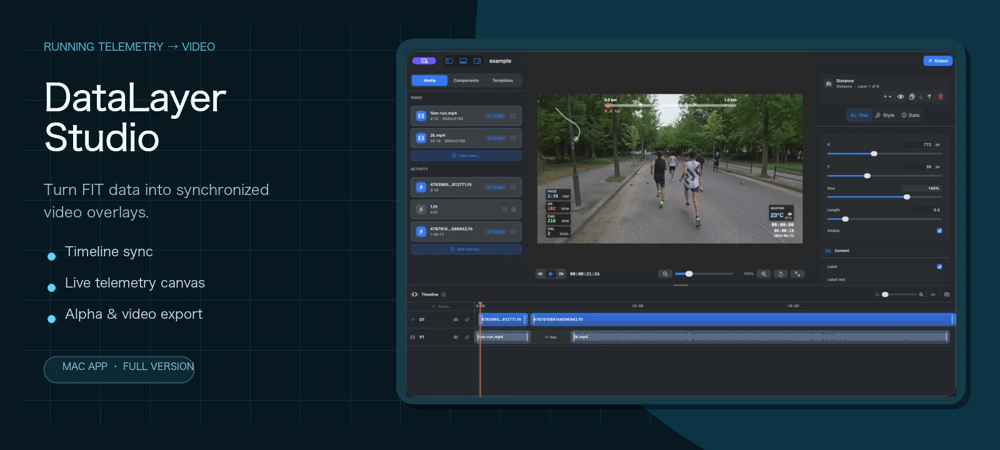
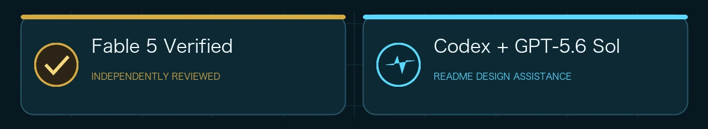
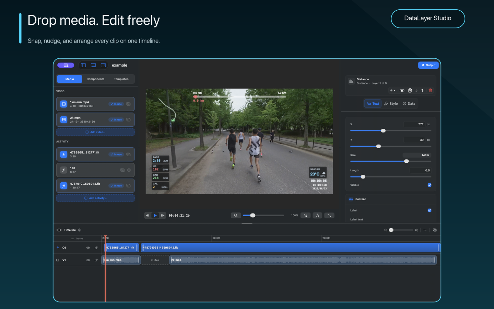
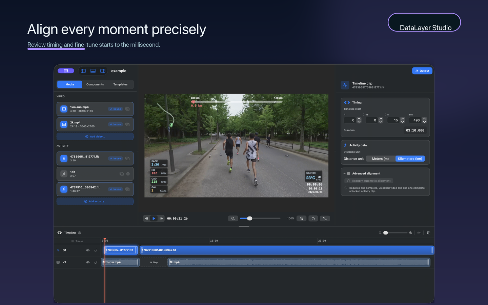
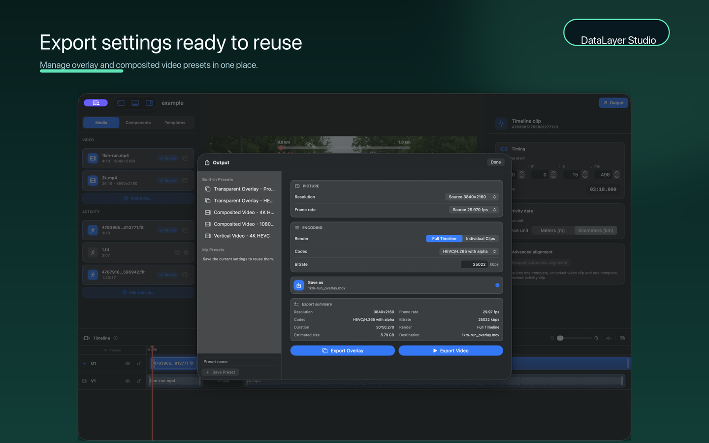
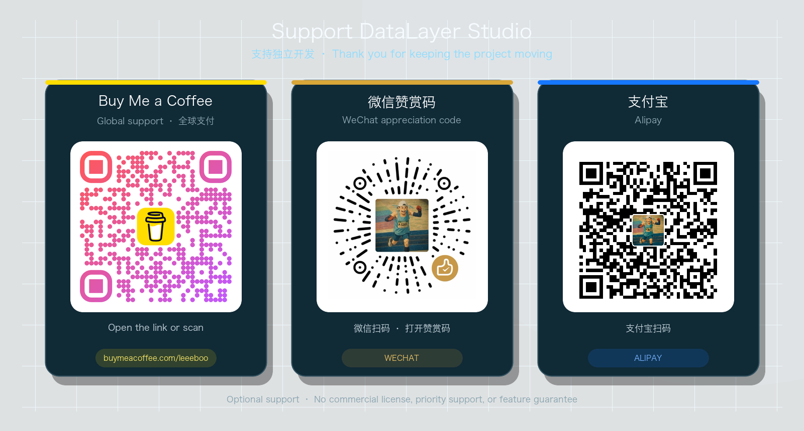

<p align="center">
  
</p>

<p align="center">
  <a href="README.md"><b>English</b></a> · <a href="README.zh-CN.md">中文</a>
</p>

<p align="center">
  <a href="https://github.com/leeeboo/DataLayer-Studio/actions/workflows/ci.yml"></a>
  <a href="https://github.com/leeeboo/DataLayer-Studio/releases/latest"></a>
  
  
  
</p>

<p align="center">
  
</p>

DataLayer Studio is a native macOS editor for turning running telemetry into clean, synchronized video graphics. Drop in footage and a `.fit` activity, align them on one timeline, arrange live gauges, then export a transparent overlay or a finished video.

<p align="center">
  <a href="https://apps.apple.com/cn/app/datalayer-studio/id6782545770"></a>
</p>

> **Free vs. paid:** the [Mac App Store version](https://apps.apple.com/cn/app/datalayer-studio/id6782545770) is the full version. The free version (GitHub releases, self-compiled builds, and the CLI) keeps every editing and preview feature, but exports are limited to 1080p and carry a "Made with DataLayer Studio" watermark. Buy the Mac App Store version to unlock full-resolution, watermark-free exports.

## From footage to data layer

One workspace carries the whole job: edit media, lock telemetry to the right moment, and choose the output your video editor needs.

| 1 · Drop and edit | 2 · Align precisely | 3 · Export your way |
| --- | --- | --- |
|  |  |  |

## Built for the edit

| | |
| --- | --- |
| **Multitrack timing** | Move, trim, split, snap, lock, and undo video or activity clips on one timeline. |
| **Live telemetry canvas** | Arrange pace, heart rate, cadence, power, route, distance, weather, time, and more over the real frame. |
| **Exact synchronization** | Drag clips into place or enter an exact relative start down to the millisecond. |
| **Reusable layouts** | Save, import, export, and reuse gauge layouts across projects. |
| **Two export paths** | Render transparent HEVC / ProRes Alpha for an NLE, or burn the graphics into the source video. |
| **The same renderer in a CLI** | Automate repeatable exports without maintaining a second visual pipeline. |

No video yet? A `.fit` file is enough to preview and play the telemetry layer.

## Start here

### Install the app

DataLayer Studio requires an Apple Silicon Mac running macOS 13 Ventura or later.

[Buy the full version on the Mac App Store](https://apps.apple.com/cn/app/datalayer-studio/id6782545770), or download the free version as a signed build from the [latest GitHub release](https://github.com/leeeboo/DataLayer-Studio/releases/latest). The free version (GitHub builds, self-compiled builds, and the CLI) has full editing and preview features; exports are limited to 1080p and include a "Made with DataLayer Studio" watermark. The Mac App Store version exports at full resolution without a watermark.

### Run from source

You need Swift 5.9 or later.

```bash
swift run datalayer-studio
```

To build a local app bundle:

```bash
scripts/build_app_bundle.sh
open ".build/DataLayer Studio.app"
```

`swift run overlay-studio` remains available as a compatibility alias for older scripts.

## Automate with the CLI

The CLI uses the same FIT parser, timeline mapping, layouts, and renderer as the app.

```bash
swift run overlay \
  --video /path/to/run-video.mov \
  --fit /path/to/activity.fit \
  --output /path/to/overlay.mov
```

Useful options:

```text
--fit-start 300          Video begins at FIT elapsed 5:00
--sync-video 12          Sync point in the video timeline
--sync-fit 0             FIT elapsed at the same sync point
--export-mode overlay    Transparent alpha overlay (default)
--export-mode video      Video with graphics burned in
--codec hevc-alpha       HEVC with alpha (overlay default)
--codec prores-4444      Alpha-capable intermediate
--layout-preset NAME     Saved app preset name, ID, or exported JSON file
--inspect                Parse metadata without rendering
```

Run `swift run overlay --help` for the complete option list.

<details>
<summary><b>How timeline sync works</b></summary>

The renderer maps each video timestamp to a FIT elapsed timestamp. Use the form that matches what you know:

```bash
# Recording starts 12 seconds before the activity.
overlay --video run.mov --fit activity.fit --output overlay.mov --offset 12

# Recording starts 8 minutes 20 seconds into the activity.
overlay --video run.mov --fit activity.fit --output overlay.mov --fit-start 500

# Video 3.2s matches FIT elapsed 41:15.
overlay --video run.mov --fit activity.fit --output overlay.mov \
  --sync-video 3.2 --sync-fit 2475
```

Before telemetry begins, the first sample is held. After telemetry ends, the last sample is held.

</details>

<details>
<summary><b>FIT data support</b></summary>

The parser validates FIT headers and CRCs and handles standard local message definitions, little- and big-endian records, and normal or compressed timestamps. Supported record fields include:

- GPS position, altitude, distance, speed, and temperature
- heart rate, cadence, power, and running-dynamics metrics
- enhanced speed and altitude

Telemetry is normalized to activity-relative distance and resampled to one-second intervals. When FIT speed is missing or stuck at zero, distance-derived speed can fill the gap. Developer fields outside the renderer's standard telemetry channels are skipped.

</details>

## Privacy and project boundaries

- Videos, activity files, GPS traces, presets, and exports stay local unless you choose to share them.
- The app has no third-party analytics SDK or custom event tracking. Aggregate usage and crash information comes from Apple's opt-in App Store analytics.
- DataLayer Studio is an independent project. It is not affiliated with, endorsed by, or sponsored by Telemetry Overlay or its developers. It does not read or modify `/Applications/Telemetry Overlay.app`, and it does not include proprietary code or assets from Telemetry Overlay.

See [PRIVACY.md](PRIVACY.md), [SECURITY.md](SECURITY.md), and [SUPPORT.md](SUPPORT.md).

## Contributing

```bash
swift build
swift test
scripts/verify_source_available_readiness.sh
```

Focused, testable pull requests are welcome. Read [CONTRIBUTING.md](CONTRIBUTING.md) before opening one, and never attach private activity data to a public issue.

## Release

When a `v*` tag is pushed, `.github/workflows/release.yml` will:

- run `scripts/verify_source_available_readiness.sh` and `swift test`
- build the release products for `overlay` and `datalayer-studio`
- build and verify `DataLayer Studio.app`, including its required legal files
- create or update the GitHub Release with the zip and SHA-256 checksum

The app bundle includes `LICENSE.md`, `NOTICE.md`, and `README.md` under `Contents/Resources/Legal`.

## Support the project

DataLayer Studio is built and maintained independently by one developer. Buying it on the [Mac App Store](https://apps.apple.com/cn/app/datalayer-studio/id6782545770) is the most direct way to fund testing and continued development.

<p align="center">
  
</p>

<p align="center">
  <a href="https://buymeacoffee.com/leeeboo">Open Buy Me a Coffee</a> · Scan WeChat or Alipay with the corresponding app
</p>

Sponsorship is optional and does not include a commercial license, priority support, or guaranteed feature work.

## License

DataLayer Studio is source-available for noncommercial use. It is not OSI open source: commercial use, resale, paid redistribution, and paid hosting require separate written permission. Modified versions and derivative distributions must share their corresponding source under the same terms.

See [LICENSE.md](LICENSE.md) and [NOTICE.md](NOTICE.md).
