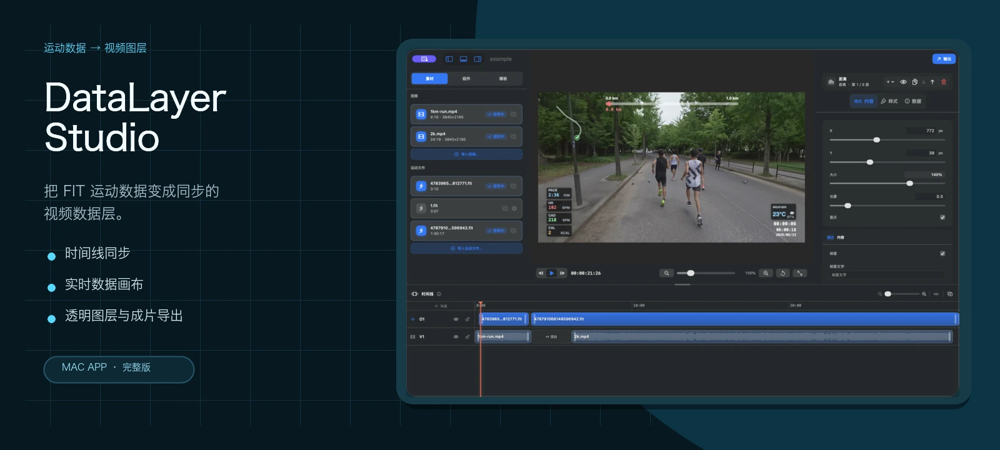
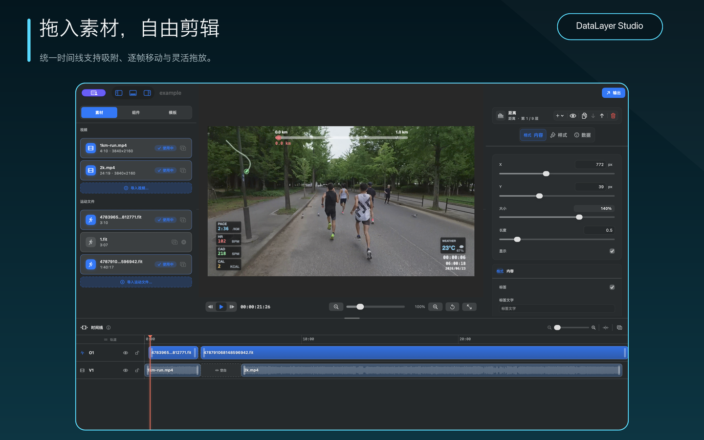
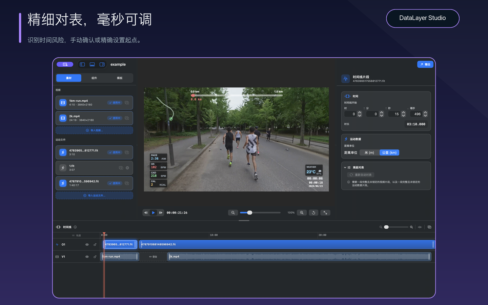
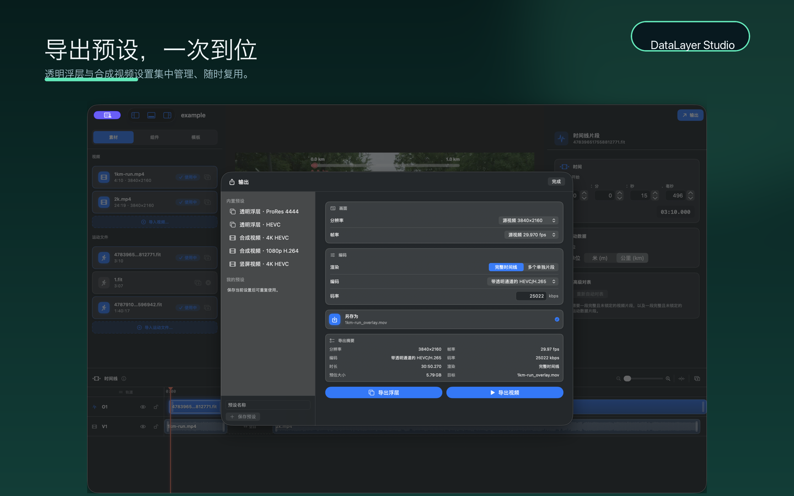

<p align="center">
  
</p>

<p align="center">
  <a href="README.md">English</a> · <a href="README.zh-CN.md"><b>中文</b></a>
</p>

<p align="center">
  <a href="https://github.com/leeeboo/DataLayer-Studio/actions/workflows/ci.yml"></a>
  <a href="https://github.com/leeeboo/DataLayer-Studio/releases/latest"></a>
  
  
  
</p>

<p align="center">
  
</p>

DataLayer Studio 是一款原生 macOS 编辑器，可以把跑步运动数据变成清晰、同步的视频图形。导入视频和 `.fit` 运动文件，在同一条时间线上完成对齐，排布实时数据组件，再导出透明数据层或已合成的成片。

<p align="center">
  <a href="https://apps.apple.com/cn/app/datalayer-studio/id6782545770"></a>
</p>

> **免费版与付费版：**[Mac App Store 版](https://apps.apple.com/cn/app/datalayer-studio/id6782545770)是完整版。免费版（GitHub Release 下载、自行编译和 CLI）保留全部编辑与预览功能，但导出最高 1080p 且右下角带 "Made with DataLayer Studio" 水印。购买 Mac App Store 版即可解锁全分辨率、无水印导出。

## 从素材到数据层

一个工作区完成整个流程：编辑素材、把运动数据锁定到正确时刻，再选择剪辑软件需要的输出格式。

| 1 · 导入并编辑 | 2 · 精准对齐 | 3 · 按需导出 |
| --- | --- | --- |
|  |  |  |

## 为剪辑而生

| | |
| --- | --- |
| **多轨时间控制** | 在同一条时间线上移动、裁剪、分割、吸附、锁定和撤销视频或运动片段。 |
| **实时数据画布** | 在真实画面上排布配速、心率、步频、功率、轨迹、距离、天气、时间等组件。 |
| **精确同步** | 直接拖动片段，或输入精确到毫秒的相对起点。 |
| **可复用布局** | 保存、导入、导出布局，并在不同项目中重复使用。 |
| **两种导出路径** | 为剪辑软件导出透明 HEVC / ProRes Alpha，或把图形直接合成到源视频。 |
| **CLI 共用同一渲染器** | 无需维护另一套视觉流程，即可自动执行可重复的导出任务。 |

还没有视频？只用一个 `.fit` 文件也能预览并播放运动数据层。

## 从这里开始

### 安装应用

DataLayer Studio 需要 Apple Silicon 芯片的 Mac，以及 macOS 13 Ventura 或更新版本。

从 [Mac App Store](https://apps.apple.com/cn/app/datalayer-studio/id6782545770) 购买完整版，或从 [最新 GitHub Release](https://github.com/leeeboo/DataLayer-Studio/releases/latest) 下载已签名的免费版。免费版（GitHub 下载、自行编译和 CLI）编辑与预览功能完整，导出最高 1080p 且右下角带 "Made with DataLayer Studio" 水印；Mac App Store 版导出全分辨率、无水印。

### 从源码运行

需要 Swift 5.9 或更新版本。

```bash
swift run datalayer-studio
```

构建本地 App bundle：

```bash
scripts/build_app_bundle.sh
open ".build/DataLayer Studio.app"
```

`swift run overlay-studio` 继续作为旧脚本的兼容别名保留。

## 用 CLI 自动化

CLI 与应用共用同一套 FIT 解析器、时间线映射、布局和渲染器。

```bash
swift run overlay \
  --video /path/to/run-video.mov \
  --fit /path/to/activity.fit \
  --output /path/to/overlay.mov
```

常用参数：

```text
--fit-start 300          视频从 FIT elapsed 5:00 开始
--sync-video 12          视频时间线上的同步点
--sync-fit 0             同一同步点对应的 FIT elapsed
--export-mode overlay    透明 Alpha 数据层（默认）
--export-mode video      已合成图形的视频
--codec hevc-alpha       HEVC Alpha（数据层默认）
--codec prores-4444      支持 Alpha 的中间格式
--layout-preset NAME     已保存的应用预设名称、ID 或导出的 JSON 文件
--inspect                只解析元数据，不渲染
```

运行 `swift run overlay --help` 查看完整参数列表。

<details>
<summary><b>时间线同步原理</b></summary>

渲染器会把每个视频时间戳映射到 FIT elapsed 时间。根据已有信息选择对应形式：

```bash
# 录像比运动早开始 12 秒。
overlay --video run.mov --fit activity.fit --output overlay.mov --offset 12

# 录像从运动开始后 8 分 20 秒开始。
overlay --video run.mov --fit activity.fit --output overlay.mov --fit-start 500

# 视频 3.2 秒对应 FIT elapsed 41:15。
overlay --video run.mov --fit activity.fit --output overlay.mov \
  --sync-video 3.2 --sync-fit 2475
```

运动数据开始前会保持第一个样本；运动数据结束后会保持最后一个样本。

</details>

<details>
<summary><b>FIT 数据支持</b></summary>

解析器会校验 FIT header 和 CRC，并支持标准 local message definitions、小端和大端记录，以及普通或压缩时间戳。支持的 record 字段包括：

- GPS 位置、海拔、距离、速度和温度
- 心率、步频、功率和跑步动态指标
- enhanced speed 和 enhanced altitude

运动数据会归一化为活动相对距离，并重采样到一秒间隔。当 FIT speed 缺失或卡在零时，可以使用距离推导速度补足。不属于渲染器标准运动数据通道的 developer fields 会被跳过。

</details>

## 隐私与项目边界

- 视频、运动文件、GPS 轨迹、预设和导出结果均保留在本地，除非你主动分享。
- 应用不包含第三方分析 SDK，也不做自定义事件埋点。聚合使用和崩溃信息来自 Apple 的可选 App Store 分析。
- DataLayer Studio 是独立项目，不隶属于 Telemetry Overlay，也未获得其开发者的认可、赞助或授权。它不会读取或修改 `/Applications/Telemetry Overlay.app`，也不包含 Telemetry Overlay 的专有代码或素材。

详见 [PRIVACY.md](PRIVACY.md)、[SECURITY.md](SECURITY.md) 和 [SUPPORT.md](SUPPORT.md)。

## 参与贡献

```bash
swift build
swift test
scripts/verify_source_available_readiness.sh
```

欢迎提交聚焦、可测试的 Pull Request。提交前请阅读 [CONTRIBUTING.md](CONTRIBUTING.md)，不要在公开 issue 中附带私人运动数据。

## 发布

推送 `v*` tag 后，`.github/workflows/release.yml` 会：

- 运行 `scripts/verify_source_available_readiness.sh` 和 `swift test`
- 构建 `overlay` 与 `datalayer-studio` 的 release 产物
- 构建并校验 `DataLayer Studio.app`，包括必要的法律文件
- 创建或更新 GitHub Release，并附带 zip 和 SHA-256 校验和

App bundle 会在 `Contents/Resources/Legal` 下包含 `LICENSE.md`、`NOTICE.md` 和 `README.md`。

## 支持项目

DataLayer Studio 由一位开发者独立开发和维护。在 [Mac App Store](https://apps.apple.com/cn/app/datalayer-studio/id6782545770) 购买，是支持测试与持续开发最直接的方式。

<p align="center">
  
</p>

<p align="center">
  <a href="https://buymeacoffee.com/leeeboo">打开 Buy Me a Coffee</a> · 微信与支付宝请使用对应应用扫码
</p>

赞助是自愿支持，不包含商业授权、优先支持或功能承诺。

<p align="center">
  
</p>

## 授权

DataLayer Studio 以 source-available 方式提供，仅允许非商业使用。这不是 OSI 开源软件：商业使用、转售、付费再分发和付费托管需要另行获得书面许可。修改版本和衍生分发必须在相同条款下共享对应源代码。

详见 [LICENSE.md](LICENSE.md) 和 [NOTICE.md](NOTICE.md)。
