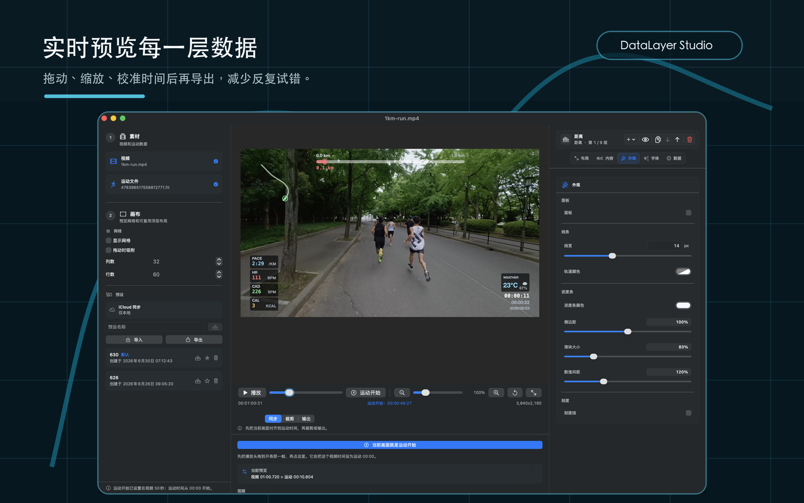
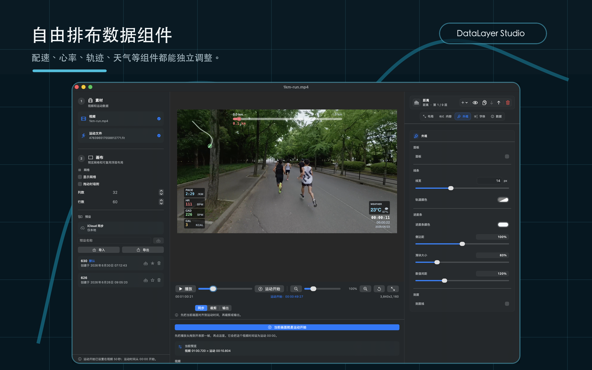
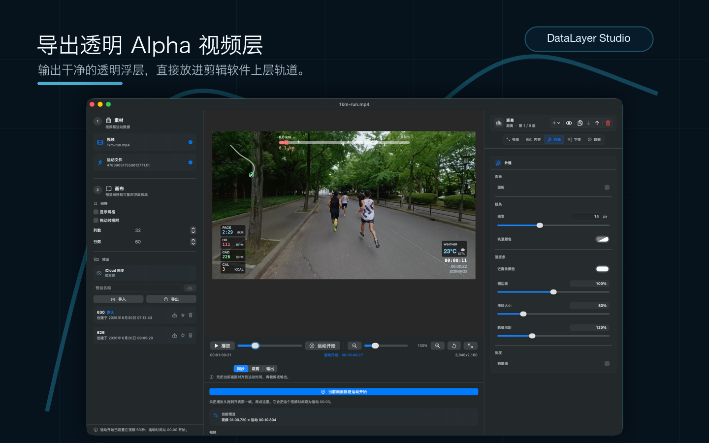

# DataLayer Studio

[English](README.md) | [中文](README.zh-CN.md)

<p>
  <a href="https://apps.apple.com/cn/app/datalayer-studio/id6782545770">
    
  </a>
</p>

<p>
  
</p>

DataLayer Studio 可以把跑步运动数据做成清爽的视频数据层，适合比赛回顾、训练分析和社交短片。你可以用 macOS 编辑器可视化排版，也可以用命令行批量导出。

它需要：

- 一个源视频文件，用于读取分辨率、帧率和时长
- 一个标准 `.fit` 运动文件，用于读取 GPS 和跑步指标

它既可以导出带 alpha 通道的透明 `.mov`，放在 Final Cut Pro、DaVinci Resolve、Premiere 等剪辑软件的上层轨道，也可以直接导出已经叠加数据层的成片。

DataLayer Studio 是独立项目，不隶属于 Telemetry Overlay，也未获得 Telemetry Overlay 或其开发者的认可、赞助或授权。本项目不会读取或修改 `/Applications/Telemetry Overlay.app`，也不包含 Telemetry Overlay 的专有代码或素材。

## 最低系统要求

> 需要 Apple Silicon 芯片的 Mac，系统为 macOS 13.0 Ventura 或更新版本。

## 亮点

- 用匹配点同步视频时间线和 FIT 运动时间。
- 在实时预览画布上摆放配速、心率、步频、轨迹、距离、时间、天气等数据浮层。
- 保存可复用布局预设，适配不同视频风格。
- 导出透明 HEVC/ProRes Alpha 浮层，或导出已合成的数据视频。
- 命令行和图形界面使用同一套渲染逻辑，适合批量流程。

## App Store 截图

| 实时预览 | 排布浮层 | 导出透明浮层 |
| --- | --- | --- |
|  |  |  |

## 快速开始

从源码运行图形界面：

```bash
swift run datalayer-studio
```

或者构建本地 App：

```bash
scripts/build_app_bundle.sh
open ".build/DataLayer Studio.app"
```

运行命令行工具：

```bash
swift run overlay \
  --video /path/to/run-video.mov \
  --fit /path/to/activity.fit \
  --output /path/to/overlay.mov
```

## 赞助

DataLayer Studio 是一个独立维护的 source-available 项目。如果它对你的跑步视频制作有帮助，赞助可以支持后续测试、样本整理和持续维护。

可以任选下面任一渠道。微信或支付宝请扫描二维码。

| Buy Me a Coffee | 微信支付 | 支付宝 |
| --- | --- | --- |
| <a href="https://buymeacoffee.com/leeeboo"></a><br>[Support on Buy Me a Coffee](https://buymeacoffee.com/leeeboo) |  |  |

赞助是自愿支持，不等同于购买商业授权、优先支持或功能承诺。商业使用仍需另行获得书面授权。

## 授权

DataLayer Studio 以 source-available 方式提供，仅允许非商业使用。修改版本和衍生分发必须在相同条款下共享对应源代码。

详见 [LICENSE.md](LICENSE.md)。这不是 OSI 开源许可证，因为未经单独书面商业授权，不允许商业使用、转售、付费再分发或付费托管。

项目声明和第三方依赖说明见 [NOTICE.md](NOTICE.md)。

## 参与贡献

欢迎提交聚焦、可测试，并且符合项目许可证的 Pull Request。请先阅读：

1. 阅读 [CONTRIBUTING.md](CONTRIBUTING.md)。
2. 大型 UI、解析器、导出或授权相关改动，请先开 issue 讨论。
3. 保持 PR 足够小，方便一次审完。
4. 不要提交私人视频、FIT/GPX/TCX 文件、GPS 轨迹、凭据、构建产物或本机状态。
5. 运行与你的改动匹配的检查。

至少运行仓库就绪检查：

```bash
scripts/verify_source_available_readiness.sh
```

如果是代码改动，也请运行：

```bash
swift test
```

Pull Request 模板会要求填写你运行过的检查。影响 GUI 的改动应附一段简短的手动验证说明，例如重新构建后打开了哪个界面或流程。

漏洞或私人数据暴露问题请按 [SECURITY.md](SECURITY.md) 私下报告，不要在公开 issue 中包含敏感信息。

本地数据处理和隐私预期见 [PRIVACY.md](PRIVACY.md)。

一般支持预期见 [SUPPORT.md](SUPPORT.md)。

## 使用情况监控

DataLayer Studio 不包含第三方分析 SDK，也不做自定义应用内事件埋点。使用情况监控依赖 Apple 内置的
[App Store Connect Analytics](https://developer.apple.com/app-store-connect/analytics/)
和崩溃指标，用于查看下载、会话、活跃设备、留存、销售和崩溃率等聚合数据；这些使用数据只来自同意向开发者共享分析数据的用户。

## Issue

请使用 bug、功能请求和文档修复的 issue 模板。公开 issue 中请避免包含私人运动数据：

- 隐去 GPS 轨迹、姓名、账号 ID、设备 ID 和本地文件路径
- 除非你愿意公开，否则不要附真实视频或 FIT 文件
- 尽量使用合成或裁剪后的样本数据
- 安全问题请按 [SECURITY.md](SECURITY.md) 私下报告

## 构建

```bash
swift build
```

构建 release 二进制：

```bash
swift build -c release
```

可执行文件位置：

```bash
.build/release/overlay
```

## 图形界面

SwiftUI 编辑器可以直接通过 SwiftPM 启动：

```bash
swift run datalayer-studio
```

`swift run overlay-studio` 保留为旧本地脚本的兼容别名。

也可以打包成本地 macOS App：

```bash
scripts/build_app_bundle.sh
open ".build/DataLayer Studio.app"
```

图形界面支持：

- 选择源视频和 `.fit` 文件
- 在预览中播放源视频，并在上层实时渲染浮层
- 通过偏移、FIT 开始或同步点模式编辑时间同步
- 把当前预览时间设为运动开始，对应 FIT elapsed `0`
- 在预览画布上拖动浮层组件
- 调整重叠组件的层级
- 调整组件的显示、位置和大小
- 分别编辑速度、配速、心率、步频、距离值、轨迹、距离进度、时间日期等组件
- 修改每个组件的颜色、透明度、字体、字号、位置和大小
- 显示可配置的预览网格，并可选择拖动时吸附
- 保存、导入、导出布局预设，并设置默认预设
- 通过预设或手动输入设置输出分辨率和帧率
- 选择距离标签显示为 `m` 或 `km`
- 导出透明 Alpha 浮层，或导出已叠加数据层的原视频成片
- 设置输出码率（kbps）、编码器和目标文件

## 命令行用法

```bash
swift run overlay \
  --video /path/to/run-video.mov \
  --fit /path/to/activity.fit \
  --output /path/to/overlay.mov
```

常用参数：

```bash
--width 1920        # 覆盖源视频宽度；2...16384 且必须为偶数
--height 1080       # 覆盖源视频高度；2...16384 且必须为偶数
--fps 30            # 覆盖源视频帧率
--fit-start 300     # 视频从 FIT elapsed 5:00 开始
--sync-video 12     # 视频时间线上的同步点
--sync-fit 0        # 同一同步点对应的 FIT elapsed
--offset 2.5        # 旧版简写：视频比 FIT 早开始 2.5 秒
--bitrate 12000     # HEVC 平均码率，单位 kbps
--bitrate-bps 12000000 # 旧版显式 bps 码率
--export-mode overlay # 默认；导出透明 Alpha 浮层
--export-mode video # 导出已叠加数据层的原视频成片；必须提供 --video
--codec hevc-alpha  # overlay 模式默认；也可用 prores-4444 作为支持 alpha 的中间格式
--codec hevc        # video 模式默认；也可用 h264
--distance-unit km  # 距离标签：km（默认）或 m
--layout-preset "Race Layout" # 按名称或 ID 使用保存的 GUI 布局预设
--layout-preset presets.json # 使用 GUI 导出的布局预设 JSON 文件
--inspect           # 只解析元数据，不渲染
--skip-fit-crc      # 适合处理 CRC 异常的 FIT 导出
```

如果没有设置 `--layout-preset`，命令行渲染器会使用内置默认布局。保存的预设会从 GUI 的本地 DataLayer Studio 偏好设置中查找，先按预设 ID，再按不区分大小写的预设名称查找。当传入值是 GUI 导出的现有 JSON 文件路径时，CLI 会优先使用文件中的默认预设，否则使用文件里的第一个预设。

## 时间同步

渲染器会把每个视频时间戳映射到 FIT elapsed 时间。你可以用三种方式表达这个映射：

```bash
# 录像比运动早开始 12 秒。
overlay --video run.mov --fit activity.fit --output overlay.mov --offset 12

# 录像从运动开始后 8 分 20 秒开始。
overlay --video run.mov --fit activity.fit --output overlay.mov --fit-start 500

# 任意精确同步点：视频 3.2 秒对应 FIT elapsed 41:15。
overlay --video run.mov --fit activity.fit --output overlay.mov --sync-video 3.2 --sync-fit 2475
```

如果视频在 FIT 运动数据结束后还继续，浮层会保持最后一个 FIT 样本，而不是虚构额外运动时间。如果视频在 FIT 运动数据开始前就开始，浮层会保持第一个 FIT 样本，直到映射后的 FIT elapsed 到达零。

## 当前 FIT 支持

解析器支持标准 FIT local message definitions、小端和大端记录、文件/header CRC 校验、普通和 compressed timestamp data messages，以及标准 `record` message 字段：

- timestamp
- position latitude/longitude
- altitude and enhanced altitude
- distance
- speed and enhanced speed
- heart rate
- cadence，并会转换为跑步浮层使用的 steps per minute
- power
- temperature

解析后的遥测会归一化为活动相对距离；当 FIT speed 缺失或卡在 0 时，会用距离推导速度补足；并重采样到 1 秒间隔，让跑步开始阶段更快出现配速。

不属于浮层标准遥测通道的 developer fields 和自定义流会被跳过。布局可在 GUI 中配置，并可保存、导入、导出或作为默认布局复用。

## 发布

只有推送版本 tag 时，GitHub Actions 才会构建 release zip。普通 Pull Request 只运行较轻量的 CI 测试流程。

使用语义化版本 tag：

```bash
git tag v0.1.0
git push origin v0.1.0
```

推送 `v*` tag 后，`.github/workflows/release.yml` 会：

- 运行 `scripts/verify_source_available_readiness.sh`
- 运行 `swift test`
- 构建 `overlay` 和 `datalayer-studio` 的 release 产物
- 构建 `DataLayer Studio.app`
- 验证 App bundle 中包含必要法律文件
- 将 App 打包为 `DataLayer-Studio-<tag>-macOS-arm64.zip`
- 生成 SHA-256 校验和
- 为该 tag 创建或更新 GitHub Release，并上传两个文件

App bundle 会在 `Contents/Resources/Legal` 下包含 `LICENSE.md`、`NOTICE.md` 和 `README.md`。zip 会出现在对应 tag 的 GitHub Release assets 中。

发布前可以验证本地 App bundle：

```bash
scripts/verify_app_bundle.sh
```
