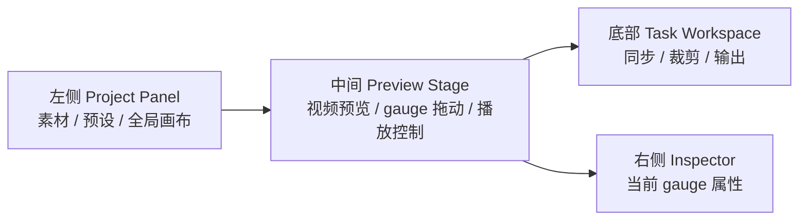

# 0.1.5 UI/UE Workbench Plan

## 背景

当前主界面把素材、同步、画布、导出都塞在左侧侧栏里，用户需要在左边切换工作流，再到中间看预览，最后到右边改 gauge 属性。这个结构能用，但认知路径偏绕：用户在“看画面”和“做任务”之间来回跳，导出设置也容易藏得太深。

0.1.5 的方向是把 DataLayer Studio 改成更像一个剪辑工作台：

- 左侧只放项目级信息：素材、布局预设、iCloud 状态、全局画布设置。
- 中间始终是预览主舞台。
- 预览下方放当前任务工作区：同步、裁剪、输出。
- 右侧只服务当前选中的 gauge：位置、样式、字体、数据内容。

## 当前状态（2026-07-04）

- 阶段 1 已完成：左侧已经改为项目面板，只保留素材、画布和预设。
- 阶段 2 已完成：预览区下方已经加入 Bottom Workspace，并承载同步、裁剪、输出三个任务。
- 阶段 3 已完成：导出设置、导出摘要和导出按钮已经从左侧迁移到底部输出任务里。
- 阶段 4 基本完成：窗口顶部中间已经显示当前视频文件名；无视频时显示 FIT/GPX 文件名。
- 下一步从阶段 5 开始：整理右侧 Inspector 的层级、顺序和高频操作，再补阶段 6 的键盘流。

## 目标结构

## 阶段 1：信息架构重排

### 改动

- 移除左侧顶部的四段工作流切换。
- 左侧改为 Project Panel，只保留：
  - 素材：视频、FIT/GPX 文件和加载失败提示。
  - 画布：网格显示、吸附、网格行列。
  - 预设：保存、导入、导出、默认预设、iCloud 同步状态。
- 中间预览保持主视觉焦点。
- 右侧 Inspector 保持只编辑当前选中 gauge。

### 不做

- 不改 gauge 属性结构。
- 不改导出、FIT/GPX 解析、天气请求、购买校验。

## 阶段 2：底部任务工作区

### 改动

预览控制条下方新增一个固定的 Bottom Workspace，用分段切换三个任务：

1. 同步
   - “运动开始”按钮。
   - 当前视频时间和运动时间映射。
   - 视频点、运动点的毫秒级输入。
   - FIT/GPX-only 模式展示无需同步说明。

2. 裁剪
   - 导出范围双手柄。
   - “当前为开始”和“当前为结束”按钮。
   - 开始、结束、时长摘要。

3. 输出
   - 分辨率、帧率、码率、距离单位、编码、保存位置。
   - 导出摘要：类型、时长、预估大小、目标文件。
   - 导出类型：透明浮层 / 合成视频。
   - 底部固定导出按钮或取消按钮。

### 原则

- Bottom Workspace 有高度上限，内容多时自己滚动，不挤压预览到不可用。
- 全屏预览不显示 Bottom Workspace，只保留播放控制。
- 输出按钮只出现在输出任务里，减少误触。

## 阶段 3：导出页瘦身

### 改动

- 导出设置从左侧侧栏移到 Bottom Workspace 的“输出”页。
- 裁剪范围从导出设置里拆到独立“裁剪”页。
- 左侧不再承担导出表单职责。
- 导出按钮固定在输出页底部，让用户完成设置后自然向下执行。

### 校验点

- 透明浮层导出默认行为不变。
- 合成视频导出仍需要源视频；FIT/GPX-only 模式下不能选择合成视频。
- 默认文件名、编码过滤、覆盖确认、导出完成通知沿用现有模型逻辑。

## 后续阶段

### 阶段 4：顶部文件状态

- 在窗口顶部中间展示当前打开的视频文件名。
- FIT/GPX-only 模式展示运动文件名。
- 可追加加载状态、导出状态、未保存布局提示。

### 阶段 5：Inspector 分组整理

- 右侧 Inspector 保持 current gauge only，但减少重复层级。
- 把位置、内容、外观、字体、数据来源按使用频率重新排序。
- 重要开关放到分组标题或分组顶部。

### 阶段 6：快捷操作和键盘流

- 同步、裁剪、输出增加菜单命令和快捷键。
- 播放头、裁剪起止点、导出动作支持更明确的键盘操作。
- Debug 入口继续放在系统菜单，避免污染主界面。

## 风险控制

- 本轮只改 SwiftUI 视图组织，不改 `StudioModel.export()`、视频 writer、透明 Alpha 路径。
- 复用现有控件，避免引入新的状态模型。
- 新增文案必须同步英文、简体中文、繁体中文、日文。
- 改 UI 后需要运行 `scripts/build_app_bundle.sh` 验证本地 app。
